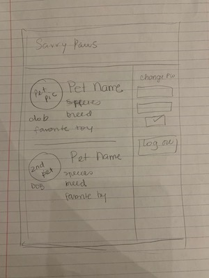

# Savvy Paws

This is a Full Stack project in which this is the front-end repository
Check the back-end repository at https://github.com/patybn3/Savvy-Paws-Full-Stack
Back-end built using Heroku, Git and GitHub
Heroku: https://tranquil-earth-29477.herokuapp.com/

## Objective:

To create a functional Application in which will track the information of an user and its pets, allowing the user to keep their personal and pet's information private and allowing the user to edit, add and delete their pets.

## Requirements to Follow:

The front and the back-end of this application is to be built individually.
Both front-end and back-end are to be store in a public GitHub account. The back-end of the web application also uses Heroku as the server. Changes made are to be commited and deployed often to both GitHub and Heroku to keep the records up to date. Application must be functional and follow the following MVP specifications:

Version Control
Demonstrate using version control by:

Sharing your work through a git repository hosted on Github.
Making frequent, cohesive commits dating back to the first day of the project week.
1 commit on the first day of project week on both repos.
At least 1 commit every day during project week (not necessarily on both repos).

 Signup with email, password, and password confirmation. - (First and Last name added, to be used on stretch goal)
 Login with email and password.
 Logout when logged in.
 Change password with current and new password.
 Signup and Signin must only be available to not signed in users.
 Logout and Change password must only be available to signed in users.
 Give feedback to the user after each action's success or failure.
 All forms must clear after submit success and user sign-out
 (Optional) Reset form to initial state on failure
Client Specifications
 Use a front-end Javascript app to communicate with your API (both read and write) and render data that it receives in the browser.
 Use jQuery for DOM manipulation and event handling.
 Use Handlebars for view rendering.
 Have semantically clean HTML and CSS
 User must be able to create a new resource
 User must be able to update a resource
 User must be able to delete a resource
 User must be able to view a single or multiple resource(s)
 All resource actions that change data must only be available to a signed in user.
 Give feedback to the user after each action's success or failure.
 All forms must clear after submit success and user sign-out
 (Optional) Reset form to initial state on failure

Your app must not:

 Rely on refreshing the page for any functionality.
 Have any user-facing bugs.
 Display non-functional buttons, nor buttons that do not successfully complete a task.
 Show actions at inappropriate times (example: change password form when a user is not signed in).
 Forms not clearing at appropriate times (example: sign up form not clearing after success).
 Use alerts for anything.
 Display errors or warnings in the console.
 Display debugging messages in the console.

## Technology Used:

The Front-End of this project is written in the following languages:
1. HTML5
2. Bootstrap
3. CSS3
4. SCSS
5. JavaScript (ES6)
6. jQuery
7. AJAX
8. Git/GitHub
9. Handlebars

## Planning and Development Process:

# User Stories

1. As an user I would like to sign in
2. As an user I would like to sign out
3. As an user I would like to change my password
4. As an user I would like to sign up
5. As an user I would like to log in the information of my pets
6. As an user I would like to edit the information entered
7. As an user I would like to be able to delete the information entered

The original User Stories was followed by the project's Wireframe (attached below) which helped in visualizing a possible end product.
1. View 1: Fist Wireframe, front page, should contain:
Title/Header/Main page name:
Initial Nav Bar
Sign Up button that opens a Modal with a sign up form
Log In button that opnes a Modal with a sign in form
Footer with additional information

  1. SignUp Form
  Name (first, last), username, email, password, password confirmation
  Submit button (event) open Sign In form automatically
  Go Back Button closes Modal
  Sign In button in case the user is already a member opens the Sign In form.

  2. SignIn Form
  Username & password
  Submit button (event).
  Go Back form closes Modal
  Sign Up button opens Sign Up form in case user is not credentialled

Main section with About ME.

2. View 2: Second Wireframe, "second" page, members page, should contain:
Title/Header/Main page name
Initial Nav Bar
Main Section With About Me
Footer with additional information
View Your Pets button shows all pets owned by the user
Clear Pets will clear the list until loaded Again
Add New Pet will open a form on the Main Section that allows the user to add a new pet
Add New pet form has a Go Back button that hides the form
Edit Pet button only appears if "View Your Pets" button is clicked
Side Bar with Home button
Change password button and log out

## Schedule Followed:

## Client

1. Download Browser Template
2. Create a Github Repository
3. Deploy to Github Pages

## API

1. Review rails-api-one-to-many or rails-api-many-to-many
2. Scaffold your resource
3. Test your resource's end points with curl scripts
4. Update resource controller to inherit from Protected or OpenRead controller
5. Test your resource's end points with curl scripts
6. Add the relationship to a User
7. Add User ownership to resource controller

## Client

1. Review api-token-auth
2. Sign Up (curl then web app)
3. Sign In (curl then web app)
4. Change Password (curl then web app)
5. Sign Out (curl then web page)
6. All API calls have success or failure messages
7. Review query-ajax-post
8. Create resource (curl then web app)
8. Get all of their owned resources (curl then web app)
9. Delete single resource (curl then web app)
10. Update single resource (curl then web app)

 README
 Troubleshoot/Debug
 Style

## Unsolved Problems / goals

Goals:
1. Add a Many-to-Many table function for pets, a pet can have many toys.
2. Add Delete message when a pet is deleted
3. Add modal asking if user is sure about deleting the pet
4. Auto update of list
5. Review all fail and success messages
6. Add picture of specie when a specie is selected

